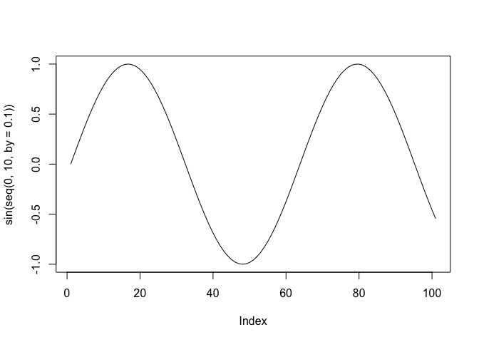

Answers to JDPers’ R Questions
================

## Disclaimer

R is an open-source project. Anyone can contribute to its codebase,
which makes it possible to use multiple ways to achieve a certain
purpose. In programmers way, we call it **There’s more than one way to
do it (TMTOWTDI)**.
(<https://en.wikipedia.org/wiki/There%27s_more_than_one_way_to_do_it>)
Sometimes, they bring us the exactly same results. Sometimes not. I’ll
try not to list all of them here, but if it is well-known that there’s a
noticeable differences between meathods, I’ll let you know.

## Introduction

This document is for UCSD/SDSU JDPers. Anybody can edit the answers.

``` r
print("hello JDPers")
```

    ## [1] "hello JDPers"

``` r
plot(sin(seq(0, 10, by=0.1)), type = 'l')
```

<!-- -->

## Package Installation and Loading

There are a few ways to install & load packages. This is the easiest
way.

  - Install a ***pacman*** package, if it is not installed in your
    computer. This is a one-time thing. If you have done it before, you
    don’t have to do it again.

<!-- end list -->

``` r
if ("pacman" %in% rownames(installed.packages()) == FALSE) {
  install.packages("pacman")
}
```

  - From now on, you don’t have to do the ***“if”*** things above for
    the package installation ever. Use this:

<!-- end list -->

``` r
pacman::p_load(tidyverse, readxl, writexl)
```

## File Read

Before we proceed to file reading, we need sample data files.

### \[FYI\] Sample File Generation

This is only for sample data generation. You don’t have to get it now.

``` r
c1 <- c(1,2,3,4,5)
c2 <- c(2,3,4,5,6)
c3 <- c(3,4,5,6,7)
dt1 <- data.frame(c1=c1, c2=c2, c3=c3)
rm(list=c("c1", "c2", "c3"))

# save it to csv
write.csv(x = dt1, file = "test.csv")

# save it to xlsx format
pacman::p_load(writexl)
write_xlsx(x = dt1, path = "test.xlsx")


# save it to Rdata format (THIS IS FASTEST!!)
save(dt1, file = "test.Rdata")
```

### CSV File read

You can read CSV files with ***read.csv*** function.

``` r
dt2 <- read.csv("test.csv")
dt2
```

    ##   X c1 c2 c3
    ## 1 1  1  2  3
    ## 2 2  2  3  4
    ## 3 3  3  4  5
    ## 4 4  4  5  6
    ## 5 5  5  6  7

### Read XLSX file

You can read XLSX files with ***read\_xlsx*** function in readxl
library.

``` r
pacman::p_load(readxl)

dt3 <- read_excel(path = "test.xlsx")
dt3
```

    ## # A tibble: 5 x 3
    ##      c1    c2    c3
    ##   <dbl> <dbl> <dbl>
    ## 1     1     2     3
    ## 2     2     3     4
    ## 3     3     4     5
    ## 4     4     5     6
    ## 5     5     6     7

### Read .Rdata file (Fastest)

.RData file is a raw data type specifically designed for R. Thus, it is
fastest way to save or load the R data object.

It has a single serious downside. You can’t change the variable name
when you load it up. It automatically loads the data object under
exactly same variable name. Let’s try it here.

``` r
# get the list of current variables
list_of_variable = ls()
list_of_variable
```

    ## [1] "dt1" "dt2" "dt3"

``` r
if ("dt1" %in% list_of_variable) {
  print("We already has the dt1 variable. I'm going to delete it.")
  rm(dt1)
} else {
  print("We don't have the dt1 variable. Let's proceed.")
}
```

    ## [1] "We already has the dt1 variable. I'm going to delete it."

``` r
# let's get the list of variables again
list_of_variable = ls()
list_of_variable
```

    ## [1] "dt2"              "dt3"              "list_of_variable"

``` r
print("We can see there's no dt1 variable")
```

    ## [1] "We can see there's no dt1 variable"

``` r
# let's load the RData file
load("test.Rdata")


# let's get the list of variables again
list_of_variable = ls()
list_of_variable
```

    ## [1] "dt1"              "dt2"              "dt3"              "list_of_variable"

``` r
print("We can see we have dt1 variable again")
```

    ## [1] "We can see we have dt1 variable again"

## Data Cleansing

### How to remove rows where all \[some\] columns are NA

There are a few ways to do this. In general, I pursue a good balance
between performance, readability, and extendability. This will be my
optimal solution, but not the fastest one.

#### Let’s make a sample data.

    ##  [1] "X1"  "X2"  "X3"  "X4"  "X5"  "X6"  "X7"  "X8"  "X9"  "X10" "X11" "X12"
    ## [13] "X13" "X14" "X15" "X16" "X17" "X18" "X19" "X20" "X21" "X22" "X23" "X24"
    ## [25] "X25" "X26" "X27" "X28" "X29" "X30" "X31" "X32" "X33" "X34" "X35" "X36"
    ## [37] "X37" "X38" "X39" "X40" "X41" "X42" "X43" "X44" "X45" "X46" "X47" "X48"
    ## [49] "X49" "X50"

#### Let’s filter them out\!\!

I illustrated so many use cases, in order of complexity. Wayne, you can
read it through, or just read the last one.

``` r
# if X2 is NA, exclude them
dt2 <- dt1 %>% filter(!is.na(X2))  # if X2 is not(!) NA, leave them. Otherwise, filter out.
head(dt2)
```

    ##   pids X1 X2 X3 X4 X5 X6 X7 X8 X9 X10 X11 X12 X13 X14 X15 X16 X17 X18 X19 X20
    ## 1    1  2  4  4  5 NA  1  5  1  3   5   3   2   4   1   1   1   5   4   4   5
    ## 2    2  2  2  5  2  5  2  4  4  3  NA   5   5   3   5   3   4   1   3   1   4
    ## 3    3  3  5  2 NA  1  2  3  1  2   1   3   2   1   1   3   4   1   1  NA  NA
    ## 4    4 NA  3 NA  3  2  5  4  2  2   1   4   4   5   5   2   2   1   4   4   1
    ## 5    5  3  3  3  2  2  3  3  5  3   4   1  NA   2   2   5   5   2   2   5   3
    ## 6    6  4  5  5  4  3  1  2  3  3   1   4   1   2   3   2   2   5   5   5   3
    ##   X21 X22 X23 X24 X25 X26 X27 X28 X29 X30 X31 X32 X33 X34 X35 X36 X37 X38 X39
    ## 1  NA   3   2   5   2   4   5   5   1   2   4   4  NA   1   1   5   1   1   4
    ## 2   5   5   4   3   3   4   5   5   5   3   3   3   3   3   5   4   3   5   2
    ## 3   4   3   5   5   3   1   4   1   5   2   1   1   2   4  NA   3   1   3   4
    ## 4   3   1   5   5  NA   5   3   1   4   5   5   2   4   3   3   3  NA   1   5
    ## 5   3   3   4   5   3   1   5   5   1   3   5   5   4   1   3   1   4   1   3
    ## 6   4   3   2   3  NA   3   2   4   4   5   1   5   4   4   2   5   4  NA   2
    ##   X40 X41 X42 X43 X44 X45 X46 X47 X48 X49 X50
    ## 1   1   2  NA   1   3   3   2   3   5   3   4
    ## 2   3   4   5   4   2   2   1   1   4   2   1
    ## 3   5   4   3   4   4   5   1   4   5   1   2
    ## 4   5   3   4   5   5   2   2   2   2   4   3
    ## 5   5   1   5   5   5   2   4   1   5   1   5
    ## 6   5   5   4  NA   4   5   4   1   1   5   3

``` r
# if X2 and X3 are both NA, exclude them

dt3 <- dt1 %>% filter(!(is.na(X2) & is.na(X3))) # if X2 is not(!) NA and X3 is not NA, leave them. Otherwise, filter out.
head(dt3)
```

    ##   pids X1 X2 X3 X4 X5 X6 X7 X8 X9 X10 X11 X12 X13 X14 X15 X16 X17 X18 X19 X20
    ## 1    1  2  4  4  5 NA  1  5  1  3   5   3   2   4   1   1   1   5   4   4   5
    ## 2    2  2  2  5  2  5  2  4  4  3  NA   5   5   3   5   3   4   1   3   1   4
    ## 3    3  3  5  2 NA  1  2  3  1  2   1   3   2   1   1   3   4   1   1  NA  NA
    ## 4    4 NA  3 NA  3  2  5  4  2  2   1   4   4   5   5   2   2   1   4   4   1
    ## 5    5  3  3  3  2  2  3  3  5  3   4   1  NA   2   2   5   5   2   2   5   3
    ## 6    6  4  5  5  4  3  1  2  3  3   1   4   1   2   3   2   2   5   5   5   3
    ##   X21 X22 X23 X24 X25 X26 X27 X28 X29 X30 X31 X32 X33 X34 X35 X36 X37 X38 X39
    ## 1  NA   3   2   5   2   4   5   5   1   2   4   4  NA   1   1   5   1   1   4
    ## 2   5   5   4   3   3   4   5   5   5   3   3   3   3   3   5   4   3   5   2
    ## 3   4   3   5   5   3   1   4   1   5   2   1   1   2   4  NA   3   1   3   4
    ## 4   3   1   5   5  NA   5   3   1   4   5   5   2   4   3   3   3  NA   1   5
    ## 5   3   3   4   5   3   1   5   5   1   3   5   5   4   1   3   1   4   1   3
    ## 6   4   3   2   3  NA   3   2   4   4   5   1   5   4   4   2   5   4  NA   2
    ##   X40 X41 X42 X43 X44 X45 X46 X47 X48 X49 X50
    ## 1   1   2  NA   1   3   3   2   3   5   3   4
    ## 2   3   4   5   4   2   2   1   1   4   2   1
    ## 3   5   4   3   4   4   5   1   4   5   1   2
    ## 4   5   3   4   5   5   2   2   2   2   4   3
    ## 5   5   1   5   5   5   2   4   1   5   1   5
    ## 6   5   5   4  NA   4   5   4   1   1   5   3

``` r
# if one or more among X2, X3, X4, X5 is NA, exclude them

dt4 <- dt1 %>% filter(!across(c(X2, X3, X4, X5), is.na))
head(dt4)
```

    ##   pids X1 X2 X3 X4 X5 X6 X7 X8 X9 X10 X11 X12 X13 X14 X15 X16 X17 X18 X19 X20
    ## 1    1  2  4  4  5 NA  1  5  1  3   5   3   2   4   1   1   1   5   4   4   5
    ## 2    2  2  2  5  2  5  2  4  4  3  NA   5   5   3   5   3   4   1   3   1   4
    ## 3    3  3  5  2 NA  1  2  3  1  2   1   3   2   1   1   3   4   1   1  NA  NA
    ## 4    4 NA  3 NA  3  2  5  4  2  2   1   4   4   5   5   2   2   1   4   4   1
    ## 5    5  3  3  3  2  2  3  3  5  3   4   1  NA   2   2   5   5   2   2   5   3
    ## 6    6  4  5  5  4  3  1  2  3  3   1   4   1   2   3   2   2   5   5   5   3
    ##   X21 X22 X23 X24 X25 X26 X27 X28 X29 X30 X31 X32 X33 X34 X35 X36 X37 X38 X39
    ## 1  NA   3   2   5   2   4   5   5   1   2   4   4  NA   1   1   5   1   1   4
    ## 2   5   5   4   3   3   4   5   5   5   3   3   3   3   3   5   4   3   5   2
    ## 3   4   3   5   5   3   1   4   1   5   2   1   1   2   4  NA   3   1   3   4
    ## 4   3   1   5   5  NA   5   3   1   4   5   5   2   4   3   3   3  NA   1   5
    ## 5   3   3   4   5   3   1   5   5   1   3   5   5   4   1   3   1   4   1   3
    ## 6   4   3   2   3  NA   3   2   4   4   5   1   5   4   4   2   5   4  NA   2
    ##   X40 X41 X42 X43 X44 X45 X46 X47 X48 X49 X50
    ## 1   1   2  NA   1   3   3   2   3   5   3   4
    ## 2   3   4   5   4   2   2   1   1   4   2   1
    ## 3   5   4   3   4   4   5   1   4   5   1   2
    ## 4   5   3   4   5   5   2   2   2   2   4   3
    ## 5   5   1   5   5   5   2   4   1   5   1   5
    ## 6   5   5   4  NA   4   5   4   1   1   5   3

``` r
# if all of X2, X3, X4, X5 are NA, exclude them
# I guess This is the best way for us, because we need to specify all the exact column names, without mistakes.

# for these columns,
col_names = c("X2", "X3", "X4", "X5")

# make a NA count column
## 1. Select all of columns in col_names from the original dataset ("." denotes the original dataset),
## 2. If the field is NA, count it as 1. otherwise count it as 0.
## 3. Calculate the sum for each row.
## 4. Leave only the na count is less than the number of columns in  col_names
dt5 <- dt1 %>% 
  mutate(na_count=rowSums(is.na(select(., all_of(col_names))))) %>%
  filter(na_count<length(col_names))

# exclude "na_count" column
head(dt5 %>% select(-na_count))
```

    ##   pids X1 X2 X3 X4 X5 X6 X7 X8 X9 X10 X11 X12 X13 X14 X15 X16 X17 X18 X19 X20
    ## 1    1  2  4  4  5 NA  1  5  1  3   5   3   2   4   1   1   1   5   4   4   5
    ## 2    2  2  2  5  2  5  2  4  4  3  NA   5   5   3   5   3   4   1   3   1   4
    ## 3    3  3  5  2 NA  1  2  3  1  2   1   3   2   1   1   3   4   1   1  NA  NA
    ## 4    4 NA  3 NA  3  2  5  4  2  2   1   4   4   5   5   2   2   1   4   4   1
    ## 5    5  3  3  3  2  2  3  3  5  3   4   1  NA   2   2   5   5   2   2   5   3
    ## 6    6  4  5  5  4  3  1  2  3  3   1   4   1   2   3   2   2   5   5   5   3
    ##   X21 X22 X23 X24 X25 X26 X27 X28 X29 X30 X31 X32 X33 X34 X35 X36 X37 X38 X39
    ## 1  NA   3   2   5   2   4   5   5   1   2   4   4  NA   1   1   5   1   1   4
    ## 2   5   5   4   3   3   4   5   5   5   3   3   3   3   3   5   4   3   5   2
    ## 3   4   3   5   5   3   1   4   1   5   2   1   1   2   4  NA   3   1   3   4
    ## 4   3   1   5   5  NA   5   3   1   4   5   5   2   4   3   3   3  NA   1   5
    ## 5   3   3   4   5   3   1   5   5   1   3   5   5   4   1   3   1   4   1   3
    ## 6   4   3   2   3  NA   3   2   4   4   5   1   5   4   4   2   5   4  NA   2
    ##   X40 X41 X42 X43 X44 X45 X46 X47 X48 X49 X50
    ## 1   1   2  NA   1   3   3   2   3   5   3   4
    ## 2   3   4   5   4   2   2   1   1   4   2   1
    ## 3   5   4   3   4   4   5   1   4   5   1   2
    ## 4   5   3   4   5   5   2   2   2   2   4   3
    ## 5   5   1   5   5   5   2   4   1   5   1   5
    ## 6   5   5   4  NA   4   5   4   1   1   5   3

``` r
# if all of X2 ... X40 are NA, exclude them

# column names are generated by lapply (=list apply) function. This is just a trick that can be used in this example.
col_names = unlist(lapply(seq(2, 40), function(x) paste0("X", x)))
dt6 <- dt1 %>% 
  mutate(na_count=rowSums(is.na(select(., all_of(col_names))))) %>%
  filter(na_count<length(col_names))

head(dt6 %>% select(-na_count))
```

    ##   pids X1 X2 X3 X4 X5 X6 X7 X8 X9 X10 X11 X12 X13 X14 X15 X16 X17 X18 X19 X20
    ## 1    1  2  4  4  5 NA  1  5  1  3   5   3   2   4   1   1   1   5   4   4   5
    ## 2    2  2  2  5  2  5  2  4  4  3  NA   5   5   3   5   3   4   1   3   1   4
    ## 3    3  3  5  2 NA  1  2  3  1  2   1   3   2   1   1   3   4   1   1  NA  NA
    ## 4    4 NA  3 NA  3  2  5  4  2  2   1   4   4   5   5   2   2   1   4   4   1
    ## 5    5  3  3  3  2  2  3  3  5  3   4   1  NA   2   2   5   5   2   2   5   3
    ## 6    6  4  5  5  4  3  1  2  3  3   1   4   1   2   3   2   2   5   5   5   3
    ##   X21 X22 X23 X24 X25 X26 X27 X28 X29 X30 X31 X32 X33 X34 X35 X36 X37 X38 X39
    ## 1  NA   3   2   5   2   4   5   5   1   2   4   4  NA   1   1   5   1   1   4
    ## 2   5   5   4   3   3   4   5   5   5   3   3   3   3   3   5   4   3   5   2
    ## 3   4   3   5   5   3   1   4   1   5   2   1   1   2   4  NA   3   1   3   4
    ## 4   3   1   5   5  NA   5   3   1   4   5   5   2   4   3   3   3  NA   1   5
    ## 5   3   3   4   5   3   1   5   5   1   3   5   5   4   1   3   1   4   1   3
    ## 6   4   3   2   3  NA   3   2   4   4   5   1   5   4   4   2   5   4  NA   2
    ##   X40 X41 X42 X43 X44 X45 X46 X47 X48 X49 X50
    ## 1   1   2  NA   1   3   3   2   3   5   3   4
    ## 2   3   4   5   4   2   2   1   1   4   2   1
    ## 3   5   4   3   4   4   5   1   4   5   1   2
    ## 4   5   3   4   5   5   2   2   2   2   4   3
    ## 5   5   1   5   5   5   2   4   1   5   1   5
    ## 6   5   5   4  NA   4   5   4   1   1   5   3

``` r
# if all of X's except pid and X36, exclude them


# if you're sure what you're doing, do this.
# it looks into all other columns, count the NAs in there, and if the number of NAs is fewer than the number of columns, it leaves. Otherwise, it excludes.
col_names = colnames(dt1)
col_names <- col_names[!col_names %in% c('pids', 'X36')]

dt7 <- dt1 %>% 
  mutate(na_count=rowSums(is.na(select(., all_of(col_names))))) %>%
  filter(na_count<length(col_names))

head(dt7 %>% select(-na_count))
```

    ##   pids X1 X2 X3 X4 X5 X6 X7 X8 X9 X10 X11 X12 X13 X14 X15 X16 X17 X18 X19 X20
    ## 1    1  2  4  4  5 NA  1  5  1  3   5   3   2   4   1   1   1   5   4   4   5
    ## 2    2  2  2  5  2  5  2  4  4  3  NA   5   5   3   5   3   4   1   3   1   4
    ## 3    3  3  5  2 NA  1  2  3  1  2   1   3   2   1   1   3   4   1   1  NA  NA
    ## 4    4 NA  3 NA  3  2  5  4  2  2   1   4   4   5   5   2   2   1   4   4   1
    ## 5    5  3  3  3  2  2  3  3  5  3   4   1  NA   2   2   5   5   2   2   5   3
    ## 6    6  4  5  5  4  3  1  2  3  3   1   4   1   2   3   2   2   5   5   5   3
    ##   X21 X22 X23 X24 X25 X26 X27 X28 X29 X30 X31 X32 X33 X34 X35 X36 X37 X38 X39
    ## 1  NA   3   2   5   2   4   5   5   1   2   4   4  NA   1   1   5   1   1   4
    ## 2   5   5   4   3   3   4   5   5   5   3   3   3   3   3   5   4   3   5   2
    ## 3   4   3   5   5   3   1   4   1   5   2   1   1   2   4  NA   3   1   3   4
    ## 4   3   1   5   5  NA   5   3   1   4   5   5   2   4   3   3   3  NA   1   5
    ## 5   3   3   4   5   3   1   5   5   1   3   5   5   4   1   3   1   4   1   3
    ## 6   4   3   2   3  NA   3   2   4   4   5   1   5   4   4   2   5   4  NA   2
    ##   X40 X41 X42 X43 X44 X45 X46 X47 X48 X49 X50
    ## 1   1   2  NA   1   3   3   2   3   5   3   4
    ## 2   3   4   5   4   2   2   1   1   4   2   1
    ## 3   5   4   3   4   4   5   1   4   5   1   2
    ## 4   5   3   4   5   5   2   2   2   2   4   3
    ## 5   5   1   5   5   5   2   4   1   5   1   5
    ## 6   5   5   4  NA   4   5   4   1   1   5   3
