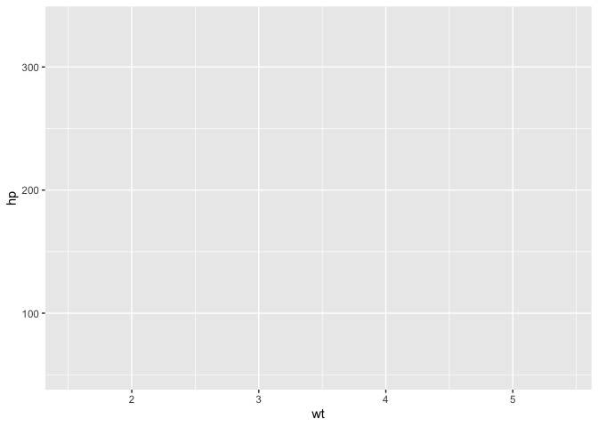
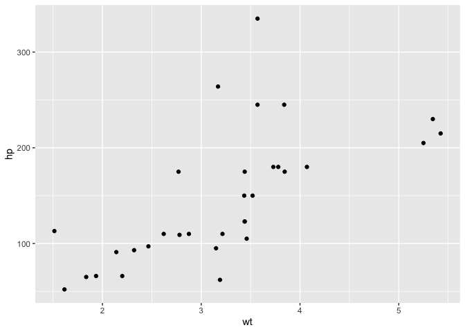
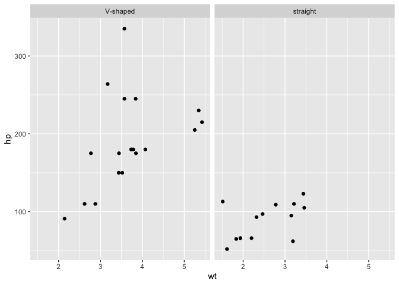
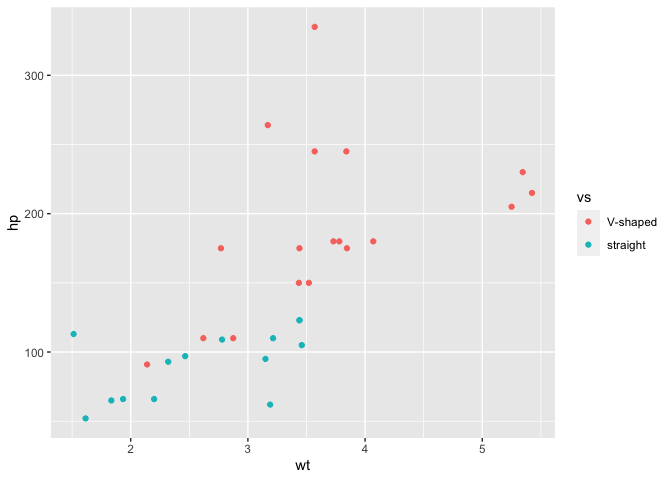
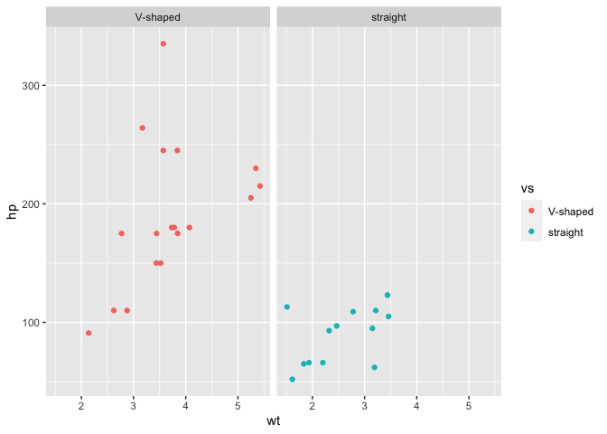

Answers to JDPers’ R Questions
================

## Disclaimer

R is an open-source project. Anyone can contribute to its codebase,
which makes it possible to use multiple ways to achieve a certain
purpose. In programmers way, we call it **There’s more than one way to
do it (TMTOWTDI)**.
(<https://en.wikipedia.org/wiki/There%27s_more_than_one_way_to_do_it>)
Sometimes, they bring us the exactly same results. Sometimes not. I’ll
try not to list all of them here, but if it is well-known that there’s a
noticeable differences between meathods, I’ll let you know.

## Introduction

This document is for UCSD/SDSU JDPers. Anybody can edit the answers.

``` r
print("hello JDPers")
```

    ## [1] "hello JDPers"

``` r
plot(sin(seq(0, 10, by=0.1)), type = 'l')
```

<!-- -->

## Package Installation and Loading

There are a few ways to install & load packages. This is the easiest
way.

  - Install a ***pacman*** package, if it is not installed in your
    computer. This is a one-time thing. If you have done it before, you
    don’t have to do it again.

<!-- end list -->

``` r
if ("pacman" %in% rownames(installed.packages()) == FALSE) {
  install.packages("pacman")
}
```

  - From now on, you don’t have to do the ***“if”*** things above for
    the package installation ever. Use this:

<!-- end list -->

``` r
pacman::p_load(tidyverse, readxl, writexl)
```

## File Read

Before we proceed to file reading, we need sample data files.

### \[FYI\] Sample File Generation

This is only for sample data generation. You don’t have to get it now.

``` r
c1 <- c(1,2,3,4,5)
c2 <- c(2,3,4,5,6)
c3 <- c(3,4,5,6,7)
dt1 <- data.frame(c1=c1, c2=c2, c3=c3)
rm(list=c("c1", "c2", "c3"))

# save it to csv
write.csv(x = dt1, file = "test.csv")

# save it to xlsx format
pacman::p_load(writexl)
write_xlsx(x = dt1, path = "test.xlsx")


# save it to Rdata format (THIS IS FASTEST!!)
save(dt1, file = "test.Rdata")
```

### CSV File read

You can read CSV files with ***read.csv*** function.

``` r
dt2 <- read.csv("test.csv")
dt2
```

    ##   X c1 c2 c3
    ## 1 1  1  2  3
    ## 2 2  2  3  4
    ## 3 3  3  4  5
    ## 4 4  4  5  6
    ## 5 5  5  6  7

### Read XLSX file

You can read XLSX files with ***read\_xlsx*** function in readxl
library.

``` r
pacman::p_load(readxl)

dt3 <- read_excel(path = "test.xlsx")
dt3
```

    ## # A tibble: 5 x 3
    ##      c1    c2    c3
    ##   <dbl> <dbl> <dbl>
    ## 1     1     2     3
    ## 2     2     3     4
    ## 3     3     4     5
    ## 4     4     5     6
    ## 5     5     6     7

### Read .Rdata file (Fastest)

.RData file is a raw data type specifically designed for R. Thus, it is
fastest way to save or load the R data object.

It has a single serious downside. You can’t change the variable name
when you load it up. It automatically loads the data object under
exactly same variable name. Let’s try it here.

``` r
# get the list of current variables
list_of_variable = ls()
list_of_variable
```

    ## [1] "dt1" "dt2" "dt3"

``` r
if ("dt1" %in% list_of_variable) {
  print("We already has the dt1 variable. I'm going to delete it.")
  rm(dt1)
} else {
  print("We don't have the dt1 variable. Let's proceed.")
}
```

    ## [1] "We already has the dt1 variable. I'm going to delete it."

``` r
# let's get the list of variables again
list_of_variable = ls()
list_of_variable
```

    ## [1] "dt2"              "dt3"              "list_of_variable"

``` r
print("We can see there's no dt1 variable")
```

    ## [1] "We can see there's no dt1 variable"

``` r
# let's load the RData file
load("test.Rdata")


# let's get the list of variables again
list_of_variable = ls()
list_of_variable
```

    ## [1] "dt1"              "dt2"              "dt3"              "list_of_variable"

``` r
print("We can see we have dt1 variable again")
```

    ## [1] "We can see we have dt1 variable again"

## Data Cleansing

### How to remove rows where all \[some\] columns are NA

There are a few ways to do this. In general, I pursue a good balance
between performance, readability, and extendability. This will be my
optimal solution, but not the fastest one.

#### Let’s make a sample data.

``` r
# let's clean up the memory
rm(list=ls())

# total number of participants
n = 100

# total number of variables
col_num = 50

# total number of people who responded poorly
na_dudes = 20

# total number of people who responded favorably
sincere_dudes = n - na_dudes

# total number of response values
n_responses = sincere_dudes * col_num


# let's assume there's pids
pids = 1:n

# let's make a dataframe that contains honest answers
honest_answers <- data.frame( # convert to data.frame
  matrix(  # convert to matrix (to reshape vector into rectangular shape)
    sample(  # generate random response from Likert-style items
      1:5, # likert
      col_num * sincere_dudes, # total number of answers from non-na dudes
      replace=TRUE # sampling without replacement
      ), 
    ncol = col_num, # reshape the vector into rectangular shape
    byrow=TRUE # row first ( ex: 1 2 3 / 4 5 6 / 7 8 9 ) Default is column first. (ex: 1 4 7 / 2 5 8 / 3 6 9)
  )
)

# let's make some holes in the dataset.
number_of_holes = 200
for (i in 1:number_of_holes) {
  colindex = sample(1:col_num, 1)
  rowindex = sample(1:sincere_dudes, 1)
  honest_answers[rowindex, colindex] = NA
}


# then let's create a NA response data frame
na_answers <- data.frame(
  matrix(
    rep(
      NA, 
      col_num * na_dudes
      ), 
    ncol = col_num, 
    byrow=TRUE
  )
)

# let's bind two response data frame vertically
answers <- rbind(honest_answers, na_answers)

# The column names are automatically generated as X##
colnames(answers)
```

    ##  [1] "X1"  "X2"  "X3"  "X4"  "X5"  "X6"  "X7"  "X8"  "X9"  "X10" "X11" "X12"
    ## [13] "X13" "X14" "X15" "X16" "X17" "X18" "X19" "X20" "X21" "X22" "X23" "X24"
    ## [25] "X25" "X26" "X27" "X28" "X29" "X30" "X31" "X32" "X33" "X34" "X35" "X36"
    ## [37] "X37" "X38" "X39" "X40" "X41" "X42" "X43" "X44" "X45" "X46" "X47" "X48"
    ## [49] "X49" "X50"

``` r
# let's bind pids & answers
dt1 <- cbind(pids, answers)
```

#### Let’s filter them out\!\!

I illustrated so many use cases, in order of complexity. Wayne, you can
read it through, or just read the last one.

``` r
# if X2 is NA, exclude them
dt2 <- dt1 %>% filter(!is.na(X2))  # if X2 is not(!) NA, leave them. Otherwise, filter out.
head(dt2)
```

    ##   pids X1 X2 X3 X4 X5 X6 X7 X8 X9 X10 X11 X12 X13 X14 X15 X16 X17 X18 X19 X20
    ## 1    1  3  4  5  2  2  1  2  4  5   3   1   1   1   4   2   1   1  NA   4   2
    ## 2    2  5  2  2  5  5  4  4  4  1  NA   4   1   1   5   5   4   4   3   3  NA
    ## 3    3  2  1  1  5  2  2  2  2  4   3   3   5   2   4   1   4   1   1   5   2
    ## 4    4  5  1  5  4  1  2  1  2  3   4   2   5   4   5   2   4   4   1   4   3
    ## 5    5  3  1  2  5  1  3  1  1  3  NA   2   5   5   1   1   1   5   1  NA   3
    ## 6    7  3  3  2  2  1  1  2  4  2   1   1   1   2   1   5   5   2   1   2   1
    ##   X21 X22 X23 X24 X25 X26 X27 X28 X29 X30 X31 X32 X33 X34 X35 X36 X37 X38 X39
    ## 1   5   4   3   5   2   4   4   1   5   3   2   4   3   3   5   3   1   5   1
    ## 2   4   4   1   3   4   4   2   1   2   2   1   1   4   3   4   3   1   1   4
    ## 3   2   4   1   2   1   1   3   1   3   1   2   3   5   4   5   3  NA  NA   1
    ## 4   4  NA   4   1   2   3   1   1   4   3   2   2   2   1   5   5   3   5   1
    ## 5   5   2   5   2   1   1   4   1   2   3   1   3   5  NA   2   2   4   4   5
    ## 6   3   1   5   2   5   5   5   3   3   1   4   5   2   1   3   2   4   4   1
    ##   X40 X41 X42 X43 X44 X45 X46 X47 X48 X49 X50
    ## 1   1   1   2   4   4   1   5   2   3   1   4
    ## 2   2   1   4   2   5   1   3   1   3   3   1
    ## 3   5   5   4   1   2   4   3   1   5   4   3
    ## 4   5   5   3   3   2   2   2   2   4   1  NA
    ## 5   4   5   1   2   3   1   3   3   4   3   3
    ## 6   4   3   4   3   4   5   4   4  NA   2   1

``` r
# if X2 and X3 are both NA, exclude them

dt3 <- dt1 %>% filter(!(is.na(X2) & is.na(X3))) # if X2 is not(!) NA and X3 is not NA, leave them. Otherwise, filter out.
head(dt3)
```

    ##   pids X1 X2 X3 X4 X5 X6 X7 X8 X9 X10 X11 X12 X13 X14 X15 X16 X17 X18 X19 X20
    ## 1    1  3  4  5  2  2  1  2  4  5   3   1   1   1   4   2   1   1  NA   4   2
    ## 2    2  5  2  2  5  5  4  4  4  1  NA   4   1   1   5   5   4   4   3   3  NA
    ## 3    3  2  1  1  5  2  2  2  2  4   3   3   5   2   4   1   4   1   1   5   2
    ## 4    4  5  1  5  4  1  2  1  2  3   4   2   5   4   5   2   4   4   1   4   3
    ## 5    5  3  1  2  5  1  3  1  1  3  NA   2   5   5   1   1   1   5   1  NA   3
    ## 6    6  2 NA  2  4  5  4  4  2  4   2   4   1   5   4   2   4   5   1   5   3
    ##   X21 X22 X23 X24 X25 X26 X27 X28 X29 X30 X31 X32 X33 X34 X35 X36 X37 X38 X39
    ## 1   5   4   3   5   2   4   4   1   5   3   2   4   3   3   5   3   1   5   1
    ## 2   4   4   1   3   4   4   2   1   2   2   1   1   4   3   4   3   1   1   4
    ## 3   2   4   1   2   1   1   3   1   3   1   2   3   5   4   5   3  NA  NA   1
    ## 4   4  NA   4   1   2   3   1   1   4   3   2   2   2   1   5   5   3   5   1
    ## 5   5   2   5   2   1   1   4   1   2   3   1   3   5  NA   2   2   4   4   5
    ## 6   5   3   5   3   1   3   4   5   2   1   4   3   2   4   2   3  NA  NA   5
    ##   X40 X41 X42 X43 X44 X45 X46 X47 X48 X49 X50
    ## 1   1   1   2   4   4   1   5   2   3   1   4
    ## 2   2   1   4   2   5   1   3   1   3   3   1
    ## 3   5   5   4   1   2   4   3   1   5   4   3
    ## 4   5   5   3   3   2   2   2   2   4   1  NA
    ## 5   4   5   1   2   3   1   3   3   4   3   3
    ## 6   3   5   2   2   2   5   1   3   3   2   3

``` r
# if one or more among X2, X3, X4, X5 is NA, exclude them

dt4 <- dt1 %>% filter(!across(c(X2, X3, X4, X5), is.na))
head(dt4)
```

    ##   pids X1 X2 X3 X4 X5 X6 X7 X8 X9 X10 X11 X12 X13 X14 X15 X16 X17 X18 X19 X20
    ## 1    1  3  4  5  2  2  1  2  4  5   3   1   1   1   4   2   1   1  NA   4   2
    ## 2    2  5  2  2  5  5  4  4  4  1  NA   4   1   1   5   5   4   4   3   3  NA
    ## 3    3  2  1  1  5  2  2  2  2  4   3   3   5   2   4   1   4   1   1   5   2
    ## 4    4  5  1  5  4  1  2  1  2  3   4   2   5   4   5   2   4   4   1   4   3
    ## 5    5  3  1  2  5  1  3  1  1  3  NA   2   5   5   1   1   1   5   1  NA   3
    ## 6    7  3  3  2  2  1  1  2  4  2   1   1   1   2   1   5   5   2   1   2   1
    ##   X21 X22 X23 X24 X25 X26 X27 X28 X29 X30 X31 X32 X33 X34 X35 X36 X37 X38 X39
    ## 1   5   4   3   5   2   4   4   1   5   3   2   4   3   3   5   3   1   5   1
    ## 2   4   4   1   3   4   4   2   1   2   2   1   1   4   3   4   3   1   1   4
    ## 3   2   4   1   2   1   1   3   1   3   1   2   3   5   4   5   3  NA  NA   1
    ## 4   4  NA   4   1   2   3   1   1   4   3   2   2   2   1   5   5   3   5   1
    ## 5   5   2   5   2   1   1   4   1   2   3   1   3   5  NA   2   2   4   4   5
    ## 6   3   1   5   2   5   5   5   3   3   1   4   5   2   1   3   2   4   4   1
    ##   X40 X41 X42 X43 X44 X45 X46 X47 X48 X49 X50
    ## 1   1   1   2   4   4   1   5   2   3   1   4
    ## 2   2   1   4   2   5   1   3   1   3   3   1
    ## 3   5   5   4   1   2   4   3   1   5   4   3
    ## 4   5   5   3   3   2   2   2   2   4   1  NA
    ## 5   4   5   1   2   3   1   3   3   4   3   3
    ## 6   4   3   4   3   4   5   4   4  NA   2   1

#### the best way to do this

``` r
# if all of X2, X3, X4, X5 are NA, exclude them
# I guess This is the best way for us, because we need to specify all the exact column names, without mistakes.

# for these columns,
col_names = c("X2", "X3", "X4", "X5")

# make a NA count column
## 1. Select all of columns in col_names from the original dataset ("." denotes the original dataset),
## 2. If the field is NA, count it as 1. otherwise count it as 0.
## 3. Calculate the sum for each row.
## 4. Leave only the na count is less than the number of columns in  col_names
dt5 <- dt1 %>% 
  mutate(na_count=rowSums(is.na(select(., all_of(col_names))))) %>%
  filter(na_count<length(col_names))

# exclude "na_count" column
head(dt5 %>% select(-na_count))
```

    ##   pids X1 X2 X3 X4 X5 X6 X7 X8 X9 X10 X11 X12 X13 X14 X15 X16 X17 X18 X19 X20
    ## 1    1  3  4  5  2  2  1  2  4  5   3   1   1   1   4   2   1   1  NA   4   2
    ## 2    2  5  2  2  5  5  4  4  4  1  NA   4   1   1   5   5   4   4   3   3  NA
    ## 3    3  2  1  1  5  2  2  2  2  4   3   3   5   2   4   1   4   1   1   5   2
    ## 4    4  5  1  5  4  1  2  1  2  3   4   2   5   4   5   2   4   4   1   4   3
    ## 5    5  3  1  2  5  1  3  1  1  3  NA   2   5   5   1   1   1   5   1  NA   3
    ## 6    6  2 NA  2  4  5  4  4  2  4   2   4   1   5   4   2   4   5   1   5   3
    ##   X21 X22 X23 X24 X25 X26 X27 X28 X29 X30 X31 X32 X33 X34 X35 X36 X37 X38 X39
    ## 1   5   4   3   5   2   4   4   1   5   3   2   4   3   3   5   3   1   5   1
    ## 2   4   4   1   3   4   4   2   1   2   2   1   1   4   3   4   3   1   1   4
    ## 3   2   4   1   2   1   1   3   1   3   1   2   3   5   4   5   3  NA  NA   1
    ## 4   4  NA   4   1   2   3   1   1   4   3   2   2   2   1   5   5   3   5   1
    ## 5   5   2   5   2   1   1   4   1   2   3   1   3   5  NA   2   2   4   4   5
    ## 6   5   3   5   3   1   3   4   5   2   1   4   3   2   4   2   3  NA  NA   5
    ##   X40 X41 X42 X43 X44 X45 X46 X47 X48 X49 X50
    ## 1   1   1   2   4   4   1   5   2   3   1   4
    ## 2   2   1   4   2   5   1   3   1   3   3   1
    ## 3   5   5   4   1   2   4   3   1   5   4   3
    ## 4   5   5   3   3   2   2   2   2   4   1  NA
    ## 5   4   5   1   2   3   1   3   3   4   3   3
    ## 6   3   5   2   2   2   5   1   3   3   2   3

``` r
# if all of X2 ... X40 are NA, exclude them

# column names are generated by lapply (=list apply) function. This is just a trick that can be used in this example.
col_names = unlist(lapply(seq(2, 40), function(x) paste0("X", x)))
dt6 <- dt1 %>% 
  mutate(na_count=rowSums(is.na(select(., all_of(col_names))))) %>%
  filter(na_count<length(col_names))

head(dt6 %>% select(-na_count))
```

    ##   pids X1 X2 X3 X4 X5 X6 X7 X8 X9 X10 X11 X12 X13 X14 X15 X16 X17 X18 X19 X20
    ## 1    1  3  4  5  2  2  1  2  4  5   3   1   1   1   4   2   1   1  NA   4   2
    ## 2    2  5  2  2  5  5  4  4  4  1  NA   4   1   1   5   5   4   4   3   3  NA
    ## 3    3  2  1  1  5  2  2  2  2  4   3   3   5   2   4   1   4   1   1   5   2
    ## 4    4  5  1  5  4  1  2  1  2  3   4   2   5   4   5   2   4   4   1   4   3
    ## 5    5  3  1  2  5  1  3  1  1  3  NA   2   5   5   1   1   1   5   1  NA   3
    ## 6    6  2 NA  2  4  5  4  4  2  4   2   4   1   5   4   2   4   5   1   5   3
    ##   X21 X22 X23 X24 X25 X26 X27 X28 X29 X30 X31 X32 X33 X34 X35 X36 X37 X38 X39
    ## 1   5   4   3   5   2   4   4   1   5   3   2   4   3   3   5   3   1   5   1
    ## 2   4   4   1   3   4   4   2   1   2   2   1   1   4   3   4   3   1   1   4
    ## 3   2   4   1   2   1   1   3   1   3   1   2   3   5   4   5   3  NA  NA   1
    ## 4   4  NA   4   1   2   3   1   1   4   3   2   2   2   1   5   5   3   5   1
    ## 5   5   2   5   2   1   1   4   1   2   3   1   3   5  NA   2   2   4   4   5
    ## 6   5   3   5   3   1   3   4   5   2   1   4   3   2   4   2   3  NA  NA   5
    ##   X40 X41 X42 X43 X44 X45 X46 X47 X48 X49 X50
    ## 1   1   1   2   4   4   1   5   2   3   1   4
    ## 2   2   1   4   2   5   1   3   1   3   3   1
    ## 3   5   5   4   1   2   4   3   1   5   4   3
    ## 4   5   5   3   3   2   2   2   2   4   1  NA
    ## 5   4   5   1   2   3   1   3   3   4   3   3
    ## 6   3   5   2   2   2   5   1   3   3   2   3

``` r
# if all of X's except pid and X36, exclude them


# if you're sure what you're doing, do this.
# it looks into all other columns, count the NAs in there, and if the number of NAs is fewer than the number of columns, it leaves. Otherwise, it excludes.
col_names = colnames(dt1)
col_names <- col_names[!col_names %in% c('pids', 'X36')]

dt7 <- dt1 %>% 
  mutate(na_count=rowSums(is.na(select(., all_of(col_names))))) %>%
  filter(na_count<length(col_names))

head(dt7 %>% select(-na_count))
```

    ##   pids X1 X2 X3 X4 X5 X6 X7 X8 X9 X10 X11 X12 X13 X14 X15 X16 X17 X18 X19 X20
    ## 1    1  3  4  5  2  2  1  2  4  5   3   1   1   1   4   2   1   1  NA   4   2
    ## 2    2  5  2  2  5  5  4  4  4  1  NA   4   1   1   5   5   4   4   3   3  NA
    ## 3    3  2  1  1  5  2  2  2  2  4   3   3   5   2   4   1   4   1   1   5   2
    ## 4    4  5  1  5  4  1  2  1  2  3   4   2   5   4   5   2   4   4   1   4   3
    ## 5    5  3  1  2  5  1  3  1  1  3  NA   2   5   5   1   1   1   5   1  NA   3
    ## 6    6  2 NA  2  4  5  4  4  2  4   2   4   1   5   4   2   4   5   1   5   3
    ##   X21 X22 X23 X24 X25 X26 X27 X28 X29 X30 X31 X32 X33 X34 X35 X36 X37 X38 X39
    ## 1   5   4   3   5   2   4   4   1   5   3   2   4   3   3   5   3   1   5   1
    ## 2   4   4   1   3   4   4   2   1   2   2   1   1   4   3   4   3   1   1   4
    ## 3   2   4   1   2   1   1   3   1   3   1   2   3   5   4   5   3  NA  NA   1
    ## 4   4  NA   4   1   2   3   1   1   4   3   2   2   2   1   5   5   3   5   1
    ## 5   5   2   5   2   1   1   4   1   2   3   1   3   5  NA   2   2   4   4   5
    ## 6   5   3   5   3   1   3   4   5   2   1   4   3   2   4   2   3  NA  NA   5
    ##   X40 X41 X42 X43 X44 X45 X46 X47 X48 X49 X50
    ## 1   1   1   2   4   4   1   5   2   3   1   4
    ## 2   2   1   4   2   5   1   3   1   3   3   1
    ## 3   5   5   4   1   2   4   3   1   5   4   3
    ## 4   5   5   3   3   2   2   2   2   4   1  NA
    ## 5   4   5   1   2   3   1   3   3   4   3   3
    ## 6   3   5   2   2   2   5   1   3   3   2   3

## Visualization

### Plotting more than two variables in one plot

There are a few ways to visualize more than two variables at once. There
are numerous web resources about this (with R codes) but most of them
are pretty example-based. As a researcher, you might think about the
issue from the data and variable characteristics on the basis of
principles.

These are great resources that I found:

  - <https://www.r-graph-gallery.com/index.html>
  - <https://exts.ggplot2.tidyverse.org/gallery/>
  - <https://scc.ms.unimelb.edu.au/resources-list/simple-r-scripts-for-analysis/r-scripts>
  - <http://r-statistics.co/Top50-Ggplot2-Visualizations-MasterList-R-Code.html>

It generally depends on

1.  the category of the variables (e.g., nominal, ordinal, interval,
    ratio)
2.  the order of importance of the variables (e.g., nominal-ratio-ratio,
    ordinal-nominal-ordinal, …)
3.  the information resolution of the variables (e.g., high/low)

#### How can we put information in the visualization

There are a few ways to put your information into visualization,
depending on the categories of the variables.

1.  **Nominal variable**

<!-- end list -->

  - ***[separating plotting
    panels](https://cameronpatrick.com/post/2019/11/plotting-multiple-variables-ggplot2-tidyr/index_files/figure-html/panel-plot-1.png)***
    (e.g., left/right panel,
    vertical/[horizontal](https://www.r-graph-gallery.com/48-grouped-barplot-with-ggplot2_files/figure-html/thecode-1.png)
    stacking panels, n x m matrix type stacking panels)
  - ***differentiating colors*** (e.g., red/green/blue)
  - ***shape of points*** (e.g., points, circles, dots, triangles, …)
  - ***type of lines*** (e.g., solid line, thick/thin lines, dotted
    lines, dashed lines)
  - ***hierarchical plots*** (e.g.,
    [treemaps](https://www.r-graph-gallery.com/treemap.html),
    [dendrograms](https://www.r-graph-gallery.com/dendrogram.html),
    [circle
    packing](https://www.r-graph-gallery.com/314-custom-circle-packing-with-several-levels.html))

<!-- end list -->

2.  **Ordinal variable**

<!-- end list -->

  - Some of plotting methods of nominal variables are useful. In
    general, if you can make a natural order across the type of
    visualization, it is proper way to show it. For example, shape of
    points are not proper way to show ordinal variables. (e.g., is
    triangle bigger than circle?)
  - I prefer ***separating plotting panels***\* in most cases. In some
    cases, ***grayscale*** and ***thickness of lines*** work, but not
    always.
  - If you use ***separating plotting panels*** way, if might lose some
    information details in other two variables. (i.e., tiny graphs).
    And, it might work only if the ordinal variable is the top priority
    variable (i.e., gender vs. self-efficacy vs. level of physical
    activity, in that order). If not, you might think of new type of
    visualization (i.e., [stacking bar
    plot](https://www.r-graph-gallery.com/48-grouped-barplot-with-ggplot2_files/figure-html/thecode3-1.png))

<!-- end list -->

3.  **Interval and Ratio Variables**

<!-- end list -->

  - There are not many ways to show this. The readers should recognize
    the information as **continuous** by simply looking at it.
  - ***color Gradient*** (e.g., grayscale, red-blue)
  - ***size of the symbol*** (e.g., radius of circles)
  - ***writing actual data numbers on the plot***
  - ***opaqueness or transparency***
  - ***animated plot?***
  - ***3D plots?***

#### How can we choose the chart type?

The Rule-of-thumb is the literature search. The readers don’t like new
types of cool visualization. Period. You need do literature search as
much as possible and find out what type of charts are familiar to the
readers in your field. Computer science guys are relatively open to new
types of visualizations, but they also don’t like a new way for old type
information. The potential readers DO include the editor of the journals
and the reviewers. They are not PASSIVE readers.

Next rule-of-thumb is the simplicity. Try as much as you can to suppress
use of colors. It looks good on powerpoint slides and webpages, but not
on paper. If needed, use distinct colors, not gradients. Gradients make
you sometimes hard to find what you want.

Next, don’t use something like (ordinal or more) vs. (interval or more)
vs. (interval or more). In my experience, people will have hard times to
accept more than (nominal) vs. (ratio) vs. (ratio). If they’re trained
by similar type of graphs (i.e., really popular use of single complex
type of visualization), they might understand what you meant, but it is
rare.

Finally, if you use nominal or ordinal variable, try to minimize the
cardinality of the variable by dichonomization. It’s repeated message,
keep it simple.

#### I chose the plto type. How can I draw data in R?

Let’s assume you have chosen (dichonomous) vs. (ratio) vs. (ratio).
(e.g., Gender-Height-Weight)

I am going to use a built-in dataset here. (**mtcars**) You can check
the list of build-in dataset by ***data()*** function.

``` r
data()
?mtcars
```

The first thing to do is, create a simple data frame for the plotting.
This makes you be relieved from the paint of the debugging. User
Tidyverse. If you are not familiar with **pacman**, see the [related
section
above](https://github.com/jup014/jdp_r#package-installation-and-loading)

``` r
# clear up the memory
rm(list=ls())

pacman::p_load(tidyverse, ggplot2)

# select the only fields you need to plot
mycar <- mtcars %>% select(vs, wt, hp)
```

Tell R that you want **vs** column as dichotomous (nominal).

``` r
mycar <- mycar %>% mutate(vs = recode_factor(vs, `0`="V-shaped", `1`="straight"))
```

For a test, let’s draw only weight and horsepower only. Let’s say
**weight** is input variable, and **horsepower** is outcome variable.

``` r
gp <- ggplot(mycar, aes(x=wt, y=hp))
```

By assigning ggplot object to a variable, it doesn’t show anything. You
can check the variable result by simply typing it. But since we haven’t
designated the chart type, it doesn’t show anything except an empty
panel and axis names.

``` r
gp
```

<!-- -->

Then let’s assign the plot type. Scatter plot will be a good type of the
plot. You can check the [ggplot
cheatsheet](https://www.maths.usyd.edu.au/u/UG/SM/STAT3022/r/current/Misc/data-visualization-2.1.pdf)

``` r
gp <- gp + geom_point()
gp
```

<!-- -->

Good. Let’s separate them out into two panels. **facet\_grid** does the
magic.

``` r
gp.sep <- gp + facet_grid(cols=vars(vs))
gp.sep
```

<!-- -->

This is a summary of the separating plot.

``` r
rm(list=ls())

pacman::p_load(tidyverse, ggplot2)

mycar <- mtcars %>% 
  select(vs, wt, hp) %>% 
  mutate(vs = recode_factor(vs, `0`="V-shaped", `1`="straight"))

gp <- ggplot(mycar, aes(x=wt, y=hp)) +
  geom_point() +
  facet_grid(cols=vars(vs))

gp
```

<!-- -->

If you’re interested in using colors, this is the way:

``` r
rm(list=ls())

pacman::p_load(tidyverse, ggplot2)

mycar <- mtcars %>% 
  select(vs, wt, hp) %>% 
  mutate(vs = recode_factor(vs, `0`="V-shaped", `1`="straight"))

gp <- ggplot(mycar, aes(x=wt, y=hp, color=vs)) + # this is the only changed line
  geom_point()

gp
```

<!-- -->

You can even use colors and separating panels simultaneously.

``` r
rm(list=ls())

pacman::p_load(tidyverse, ggplot2)

mycar <- mtcars %>% 
  select(vs, wt, hp) %>% 
  mutate(vs = recode_factor(vs, `0`="V-shaped", `1`="straight"))

gp <- ggplot(mycar, aes(x=wt, y=hp, color=vs)) +
  geom_point() +
  facet_grid(cols=vars(vs)) # this is the only changed line
gp
```

<!-- -->
