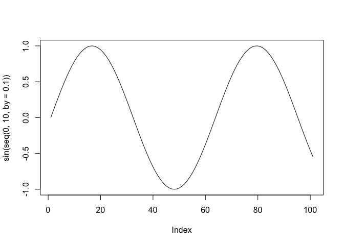

Answers to JDPers’ R Questions
================

## Introduction

This document is for UCSD/SDSU JDPers. Anybody can edit the answers.

``` r
print("hello JDPers")
```

    ## [1] "hello JDPers"

``` r
plot(sin(seq(0, 10, by=0.1)), type = 'l')
```

<!-- -->
